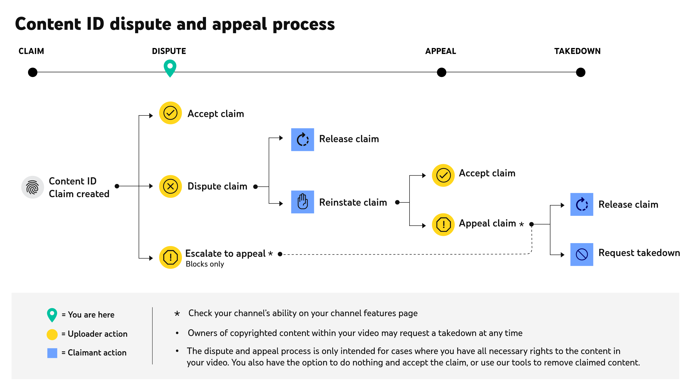

Chosen Platform: Youtube

How does the platform detect copyrighted content? Youtube uses a mix of three tools: A form submitted by rightholders to ensure youtube takes action against infringements, a match tool which automatically detects and flags copyrighted material, Content ID which pre-determines how youtube should handle flagged content (usually for music labels or studios).

What happens when content is flagged as potentially infringing? The creator or rights holder is notified which allows them to review the video and decide further action.

What is the appeals or counter-notification process? The following image from youtube’s Copyright Dispute Help page (https://support.google.com/youtube/answer/2797454?hl=en&co=GENIE.Platform%3DAndroid) describes this process well.

How does the platform handle monetization of content containing copyrighted material? As long as the content is used fairly, which means they got permission to use the content or it is used according to the fair principles described by youtube, monetization is allowed.

Are there any special programs (e.g., YouTube’s Content ID licensing agreements)? I was unable to find other special programs, but Youtube’s Content ID licensing agreements say “if a copyright owner is approved for Content ID, they'll have to complete an agreement. This agreement will explicitly state that only content with exclusive rights can be used for reference. Also, they'll need to give the geographic locations of exclusive ownership, if not worldwide.” (https://support.google.com/youtube/answer/1311402?hl=en#:~:text=If%20a%20copyright%20owner%20is,exclusive%20ownership%2C%20if%20not%20worldwide.)
