Chosen Platform: Youtube

# PART 1: Platform Copyright Policy Analysis

How does the platform detect copyrighted content? Youtube uses a mix of three tools: A form submitted by rightholders to ensure youtube takes action against infringements, a match tool which automatically detects and flags copyrighted material, Content ID which pre-determines how youtube should handle flagged content (usually for music labels or studios).

What happens when content is flagged as potentially infringing? The creator or rights holder is notified which allows them to review the video and decide further action.

What is the appeals or counter-notification process? The following image from youtube’s Copyright Dispute Help page (https://support.google.com/youtube/answer/2797454?hl=en&co=GENIE.Platform%3DAndroid) describes this process well.

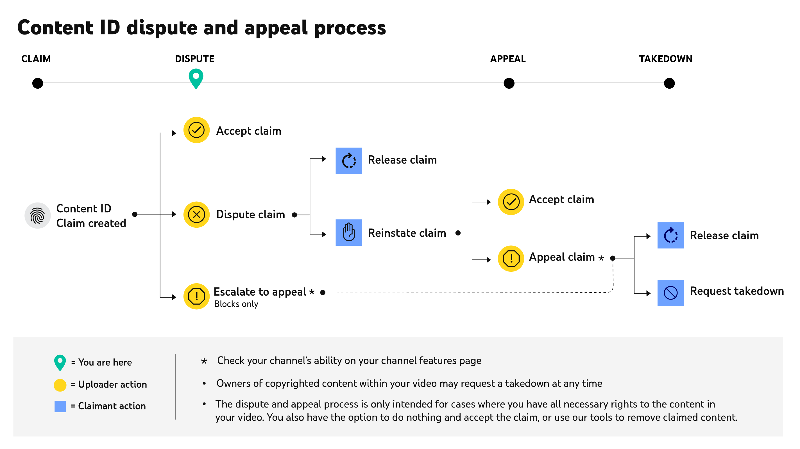

How does the platform handle monetization of content containing copyrighted material? As long as the content is used fairly, which means they got permission to use the content or it is used according to the fair principles described by youtube, monetization is allowed.

Are there any special programs (e.g., YouTube’s Content ID licensing agreements)? I was unable to find other special programs, but Youtube’s Content ID licensing agreements say “if a copyright owner is approved for Content ID, they'll have to complete an agreement. This agreement will explicitly state that only content with exclusive rights can be used for reference. Also, they'll need to give the geographic locations of exclusive ownership, if not worldwide.” (https://support.google.com/youtube/answer/1311402?hl=en#:~:text=If%20a%20copyright%20owner%20is,exclusive%20ownership%2C%20if%20not%20worldwide.)

# PART 2: Fair Use Experiments

Copyright 1: Audio Snippets of About a Girl by Nirvana and Pitch Shifted Where Did You Sleep Last Night also by Nirvana

Screenshot of successful upload:

15s:

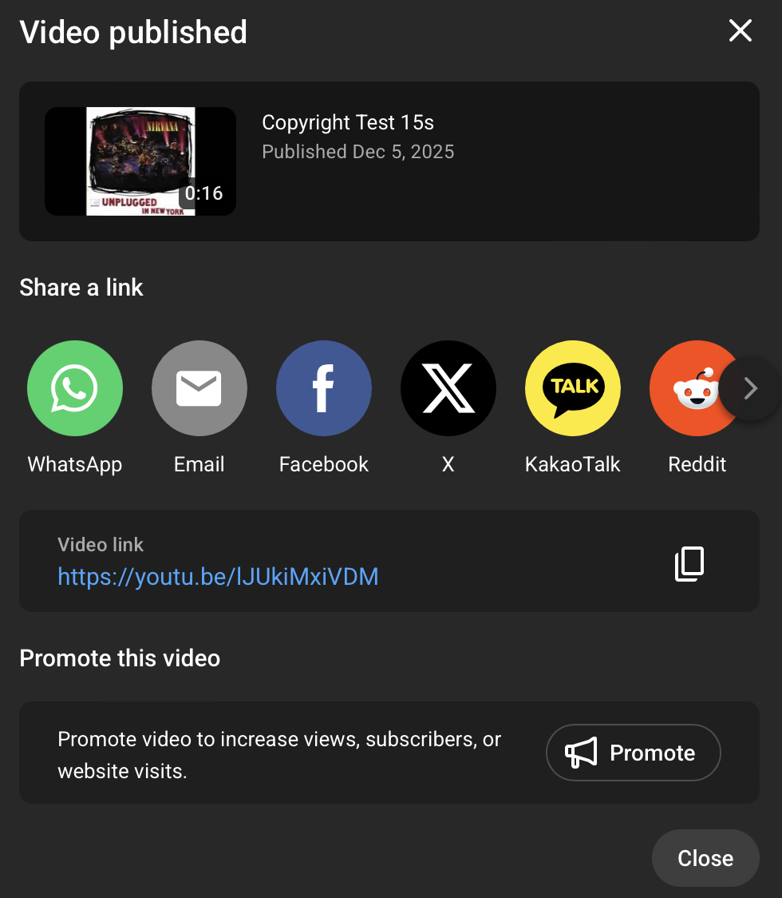

30s:

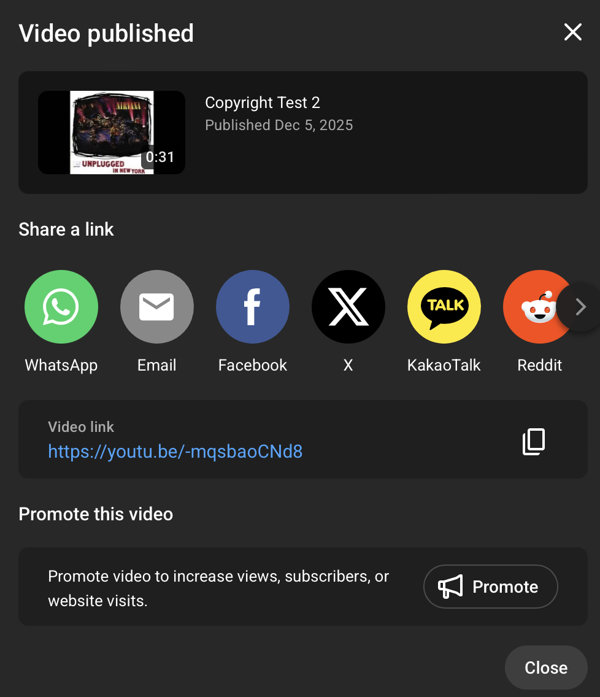

Pitch Shifted:

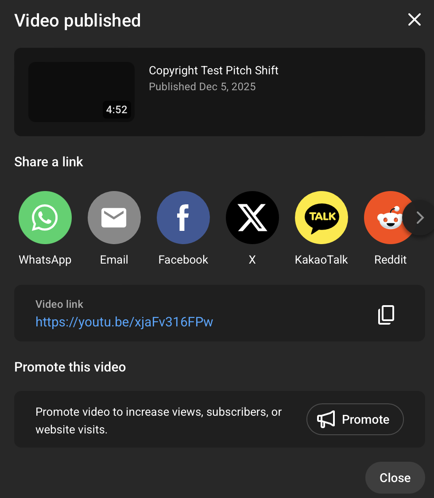

Time until detection (immediate, hours, days, never detected): 

15s: Immediate.

30s: Immediate.

Pitch Shifted: Immediate.

Screenshot of any warnings, flags, copyright claims, or takedown notices

15s:

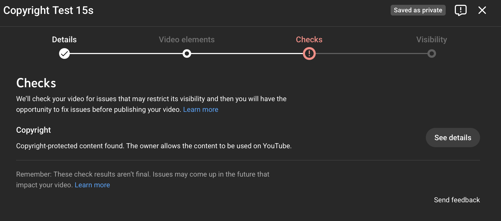

30s:

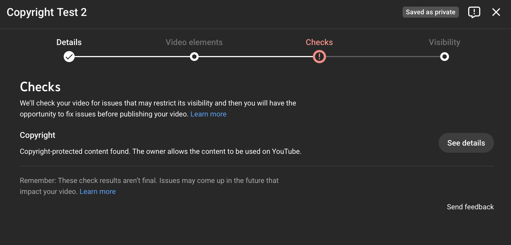

Pitch Shifted:

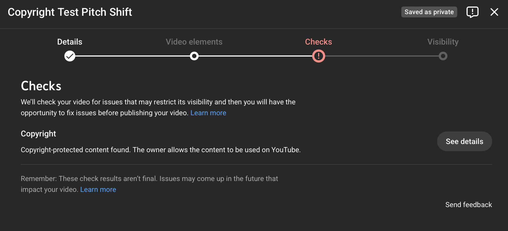

Final outcome (content stays up, gets muted, blocked in certain regions, completely removed, monetization disabled, etc.).

15s: Content stayed up

30s: Content stayed up

Pitch Shifted: Content stayed up

Any options presented to you (dispute, acknowledge, trim audio, etc.)
15s:

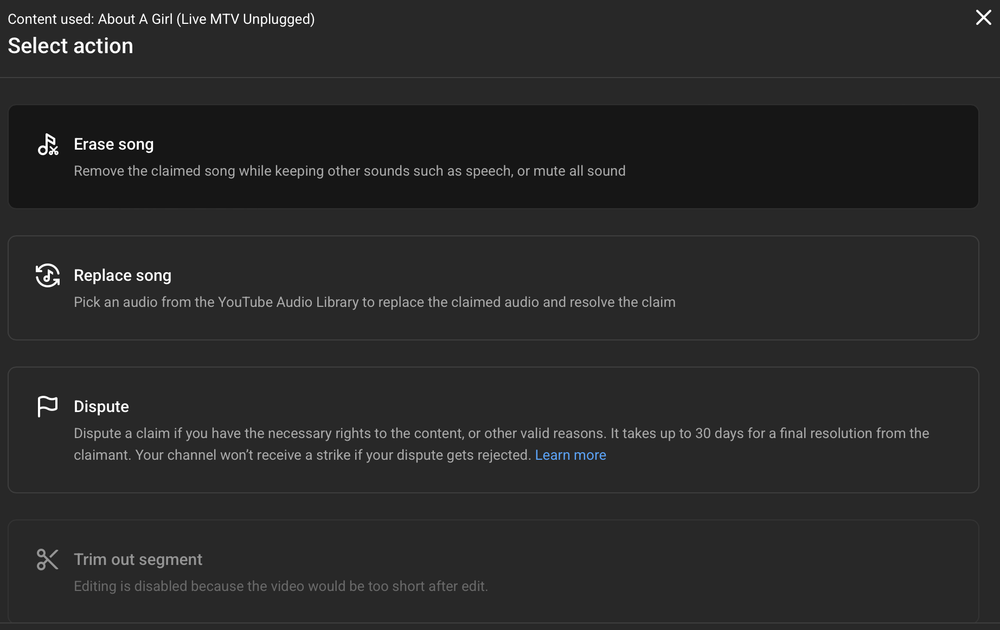

30s:

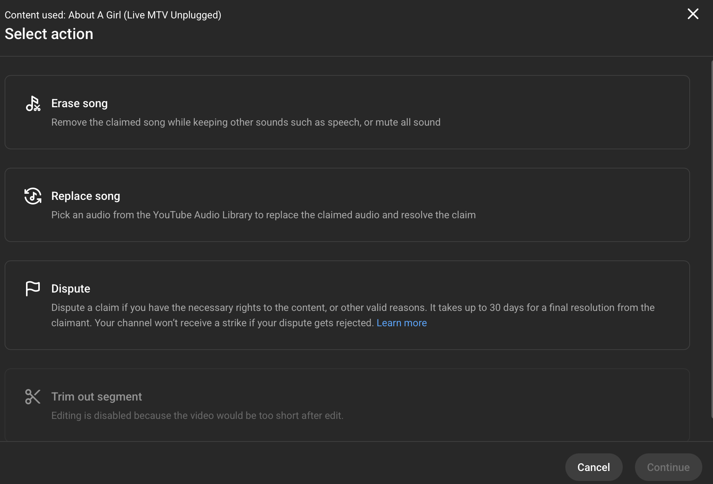

Pitch Shifted:

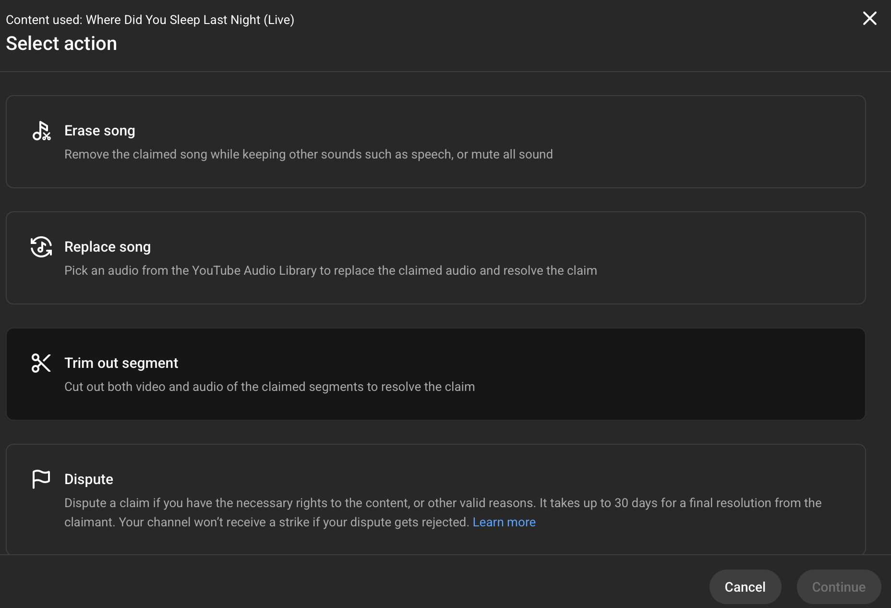

# PART 3: AI-Generated Content Investigation

What was the AI prompt?

Using Suno

1. Make a song in the style of Nirvana's MTV unplugged performance
2. Make a song in the style of Nirvana's MTV unplugged performance withe the lyrics: My girl, my girl, don't lie to me, Tell me where did you sleep last night, In the pines, in the pines, Where the sun don't ever shine, I would shiver the whole night through

Screenshot of AI-generated output

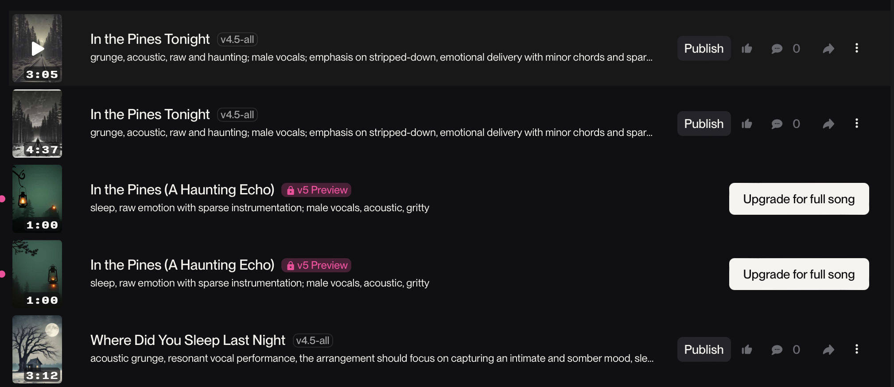

Platform response (flagged, removed, allowed, etc.)

1. Allowed.
2. Allowed.

Research findings:
What does the AI tool’s terms of service say about copyright?

They mention it is complex and varies by region especially with AI, but they follow the standard described in the next question. I didn't see anything about generated content that is too close to a real song. I tried crafting my prompts to get a real song but was unable to do so.

Who owns the copyright to AI-generated content? (you, the AI company, the creators of training data, public domain/no one?)

Dependent on plan, if free then the AI owns the created song, if paid then you own the song

What is your platform’s stated policy on AI-generated content?

They allow it but require creators to flag it as AI, surprisingly the videos I uploaded were not flagged and I did not find an option in the upload process to flag as AI

# PART 4: Legal Analysis

Fair Use Four Factors: For each of your fair use experiments (Task 2), analyze how it performs under the four fair use factors:
Purpose and character of the use (transformative? commercial?)

1. Purpose and Character: Not transformative whatsoever, the clips and pitch shifted versions are not different enough to be generally considered transformative. Their only purpose is educational and non-profit, so it alligns with fair use in this sense.

2. Nature of the work: The pieces come from a creative project (songs) so this wouldn't allign with fair use.

3. Amount and Substentiality: The works were entirely made up by the original work, in this case, even though it's 100% unoriginal, the amount is still only what was necessary for the purpose of the piece. This still wouldn't allign with fair use.

4. Effect on Market: Because the pieces were created with non-profit intentions, there is little to no effect on the market of the original songs, but had this content gone viral it could be affecting the original's market, violating fair use.

Case Law: Reference relevant cases discussed in class (e.g., Google v. Oracle, Sega v. Accolade, etc.) and explain how they might apply to your experiments or to the platform’s policies.

During the Google vs. Oracle case, Google use some of the Java API code in its Android OS. Oracle sued them for infringing on copyright laws, but Google eventually won the case as their work was transformative and Google only took what was necessary. Similarly, the work I have done only took what was necessary from the songs, even if it is not transformative like Google's.

Gap Analysis: Discuss any gaps you observed between:
Legal theory (what copyright law says)
Platform policy (what the platform claims to do)
Actual enforcement (what actually happened)

The legal theory is very solid, the problem comes with measuring some variables that help decide whether work was used fairly or not, for example, something classifying something as transformative can change between people.

Platform policy is in theory well alligned with the law, but automated detection fails sometimes to know if, for example, a song was used unfairly or just a part of a game. The content creator in this case could lose monetization for this even though it alligns with fiar use factors.

In terms of Actual Enforcement, many big corporations can get better lawyers and therefore the enforcement of these laws can be somewhat biased. It is not uncommon to see small creators and companies getting the worst end of the deal when it comes to copyright. Many cover bands can attest to this.